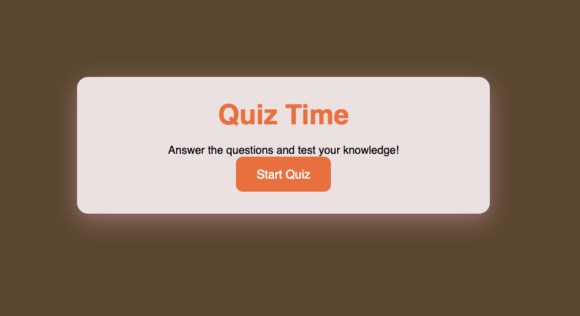
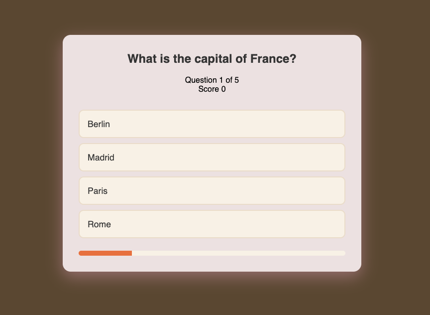
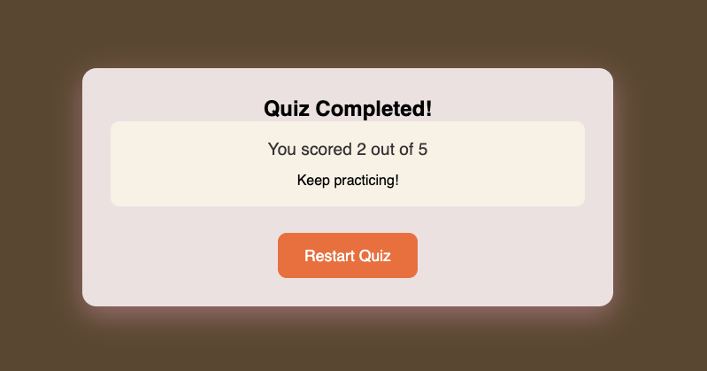

# 🎯 Quiz Game

A simple and interactive browser-based Quiz Game built using HTML, CSS, and JavaScript.

## 📖 Overview

This project presents users with multiple-choice questions, tracks their score, displays progress throughout the quiz, and provides feedback based on their final performance.

The application is fully client-side and requires no backend or external libraries.

---

## 🚀 Features

- Start quiz with a single click
- Multiple-choice questions
- Real-time score tracking
- Progress bar indicator
- Automatic question navigation
- Final score summary
- Performance-based feedback
- Restart quiz functionality
- Responsive design for desktop and mobile devices

---

## 🛠️ Technologies Used

- HTML5
- CSS3
- JavaScript (Vanilla JS)

---

## 📂 Project Structure

```text
quiz-game/
│
├── index.html
├── style.css
├── script.js
├── README.md
└── screenshots/
```


## Start Screen



## Quiz Screen



## Result Screen

