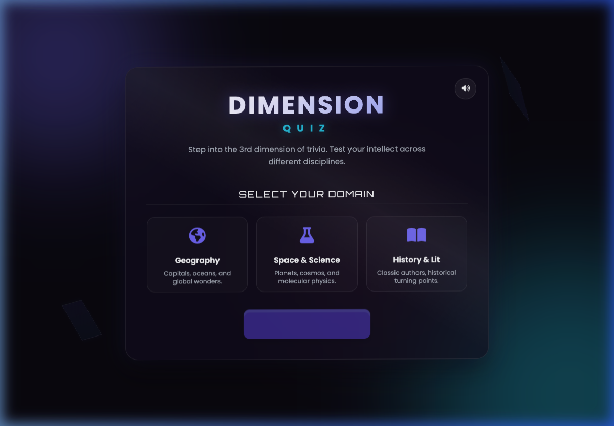
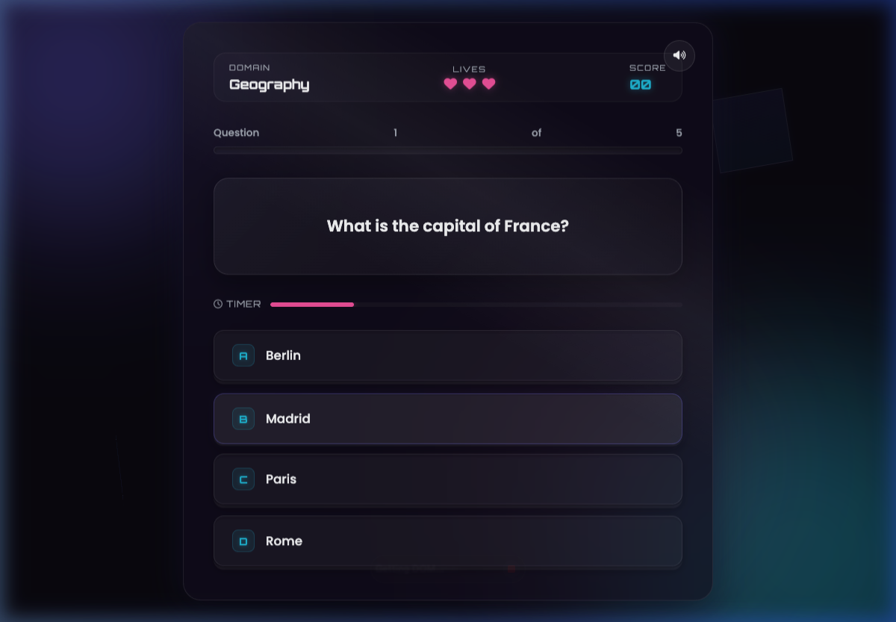
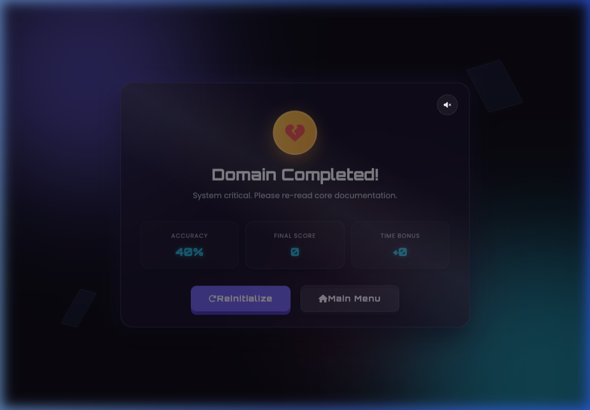

# 🔮 DimensionQuiz - 3D Trivia Experience

A premium, highly interactive, and beautiful 3D browser-based Quiz Game built with semantic HTML5, Vanilla CSS3 (3D perspective transitions), and clean Vanilla ES6 JavaScript.

## 📖 Overview

**DimensionQuiz** takes traditional trivia mechanics and elevates them with standard-compliant 3D visual designs. The application interface reacts dynamically to your mouse movement with real-time 3D parallax tilt, features tactile 3D pressable buttons, and uses a built-in synthesizer via the browser's native **Web Audio API** to generate real-time gameplay audio feedback without any external file overhead.

---

## 🚀 Features

- **3D Parallax Perspective**: The main dashboard tilts and rotates dynamically in three dimensions, tracking your cursor's positioning.
- **Pressable 3D Buttons**: Buttons are structured with realistic visual depth, depressing physically into the screen on hover and click.
- **Built-in Audio Synthesizer**: Generates custom sound waves (success chimes, failure buzzes, ticks, and completion sweeps) directly through code using the Web Audio API.
- **Multiple Trivia Domains**: Choose from three engaging categories:
  - 🌍 **Geography** (Capitals, oceans, and global wonders)
  - 🚀 **Space & Science** (Astronomy, molecules, and physics)
  - 📚 **History & Lit** (Classic playwrights, historical milestones, and pyramids)
- **Time Attack & Speed Bonuses**: A 15-second countdown timer runs on every question. Answering quickly scores extra speed points.
- **Tension & Lives HUD**: Players start with 3 lives (hearts). Answering incorrectly or letting the timer run out costs a life.
- **Triumphant Results Panel**: Displays accuracy percentage, total final score, speed bonuses, and awards a gold/silver/bronze trophy badge based on your performance.
- **Sound Toggle Controls**: Features a mute/unmute control saving your preferences to the browser's local storage.
- **Responsive Layout**: Designed to adapt gracefully to mobile viewports.

---

## 🛠️ Technologies Used

- **HTML5**: Structured semantic layout.
- **CSS3 (Custom Variables & 3D)**: Controls themes, floating ambient geometric particles, glassmorphism boundaries, and 3D perspectives (`transform-style: preserve-3d`).
- **JavaScript (Vanilla ES6)**: Handles interactive state updates, mouse tracking, ticking countdown intervals, and custom sound synthesis.
- **Web Audio API**: Browser-native sound generation.
- **Google Fonts**: Custom typeface pairing (`Orbitron` & `Poppins`) for clean digital interfaces.

---

## 📂 Project Structure

```text
updated-quiz/
│
├── index.html          # Core markup and structural screens
├── style.css           # Glassmorphism design system, variables, animations, and 3D styles
├── script.js           # Trivia database, tilt scripts, Web Audio synth, and game board loops
├── README.md           # Documentation and guides
└── screenshots/        # Visual gameplay screens
    ├── start-screen.png
    ├── quiz-screen.png
    └── result-screen.png
```

---

## 📸 Screenshots

### Start Screen


### Quiz Screen


### Result Screen

